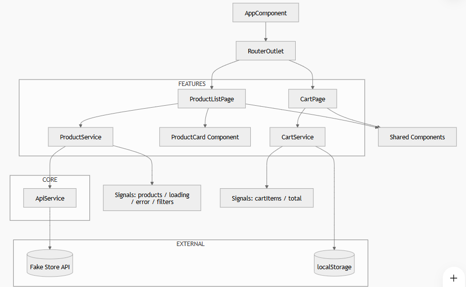

E-Shop-Gallery_kata

 Description

ShopGallery est une application  Angular E-commerce MVP . Elle permet d’afficher une liste de produits et de gérer un panier avec persistance locale.
Ce projet a été réalisé dans le cadre d’un test technique frontend.


Le projet utilise :

- Angular 21 avec composants standalone
- Angular Signals pour la gestion d’état réactive
- TypeScript strict
- SCSS pour les styles
- Angular Router pour la navigation
- Angular SSR (support serveur) via Express
- localStorage : synchronisation automatique après chaque modification du panier

 Installation & Lancement :

```bash
npm new E-shop
cd E-shop
npm install
npm start 
ng serve
```

Application disponible sur :  http://localhost:4200/

 Fonctionnalités principales

- Liste des produits récupérée depuis API
- Affichage des produits en cartes responsive
- Filtrage par catégorie
- Pagination par catégorie (affichage par blocs de 3 produits)
- Ajout au panier
- Augmentation / diminution de la quantité
- Suppression d’un produit du panier
- Total calculé dynamiquement
- Persistance du panier avec `localStorage`
- Mise à jour automatique de l’interface grâce aux signaux Angular
- Routing lazy-loaded pour les pages `products` et `cart`

1. Liste des produits

-Récupération des données depuis Fake Store API
- Affichage des produits sous forme de cartes
-Informations affichées :

  1.image
  2.titre
  3.prix
  4. Bouton add

2. Panier

- Ajout de produits
-Augmentation / diminution de quantité
- Suppression d’un produit
-Calcul dynamique : total 
- Persistance des donnees avec localStorage
- Mise à jour automatique via Angular Signals

 
 
Architecture du projet

Le projet suit une architecture modulair :

```
src/app/

├── core/                          # services global (singleton)
│   ├── services/
│   │   └── api.service.ts        → gère les appels API (Fake Store)
│                                 → utilisé par les features


├── features/                      # Modules métier (feature-based)

│
│   ├── products/                  
│   │
│   │   ├── pages/
│   │   │   └── product-list/
│   │   │       ├── product-list.component.ts  →  Page principale produits
│   │   │       ├── product-list.component.html →  UI liste produits
│   │   │       ├── product-list.component.scss → styles
│   │   │
│   │   ├── components/
│   │   │   └── product-card/     #  Composant UI réutilisable
│   │   │                         → affiche un produit (image, prix, bouton)
│   │   │
│   │   ├── services/
│   │   │   └── product.service.ts # State management produits
│   │   │                            → signals (products, loading, error)
│   │   │                           → filtre, recherche, logique métier
│   │   │
│   │   ├── models/
│   │       └── product.model.ts   → typage des données API
│
│   ├── cart/                   
│   │
│   │   ├── pages/
│   │   │   └── cart-page/         → affiche produits ajoutés
│   │
│   │   ├── components/
│   │   │   └── cart-item/         → + / - quantité, suppression
│   │
│   │   ├── services/
│   │   │   └── cart.service.ts     Logique panier
│   │   │                           # → add/remove/update
│   │   │                           # → synchronisation localStorage
│   │   │                           # → state avec signals
│   │   │
│   │   ├── models/
│   │       └── cart.model.ts      

├── shared/                        # UI réutilisable

├── app.routes.ts                 #  Routing principal → lazy loading products/cart

├── app.config.ts                 #  Config Angular globale → providers (router, httpClient)

├── app.component.ts              # Root component  → <router-outlet>
```


 Gestion d’état:

Le panier est géré avec Angular Signals :

-signal() → état interne
-computed() → dérivés (total, count)
-mise à jour réactive automatique


 Persistance des données:

-Utilisation de `localStorage`
-Chargement des données au démarrage
-Synchronisation automatique après chaque modification

-> Permet de conserver le panier après rafraîchissement


 Limitations

* Pas d’authentification utilisateur
* Pas de backend réel
* Pas de gestion de stock

 Améliorations possibles

* Page détail produit
* Authentification utilisateur
* Intégration backend (Node / Spring)
* Paiement (Stripe)
* Lazy loading des modules
* Animations avancées

Tests

```bash
npm install -D vitest @vitest/ui jsdom @testing-library/angular
ng test
```
